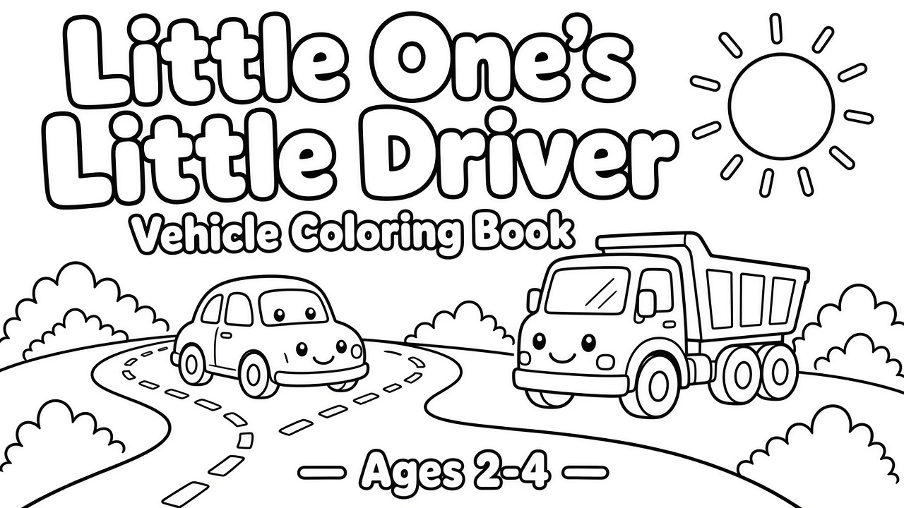
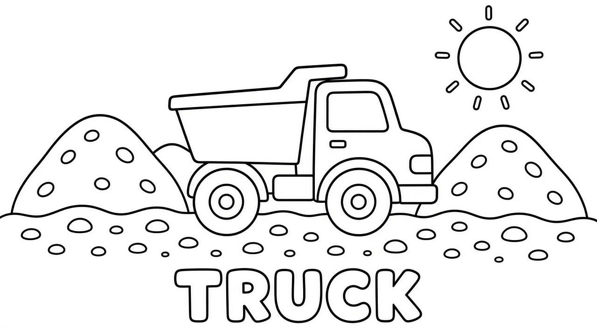
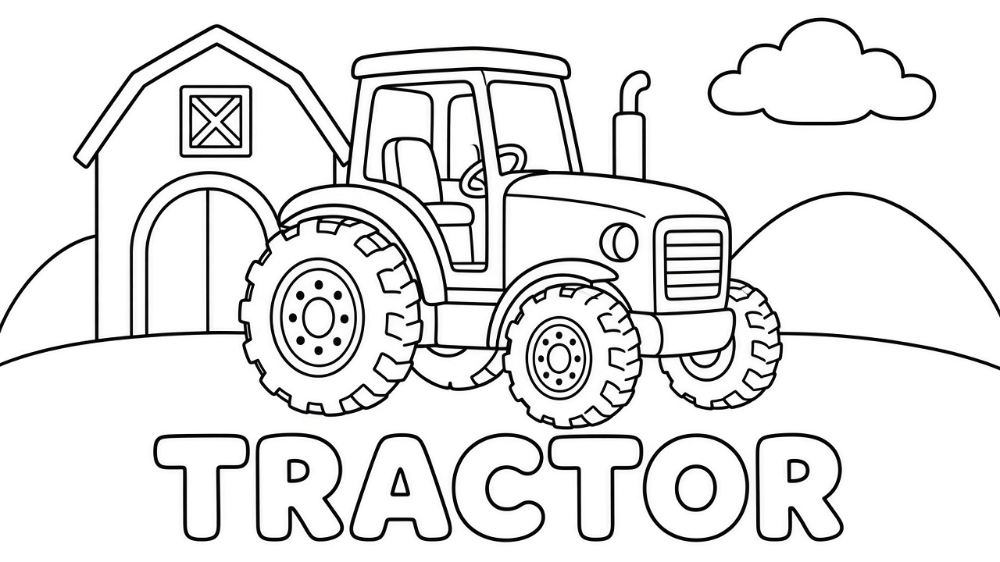
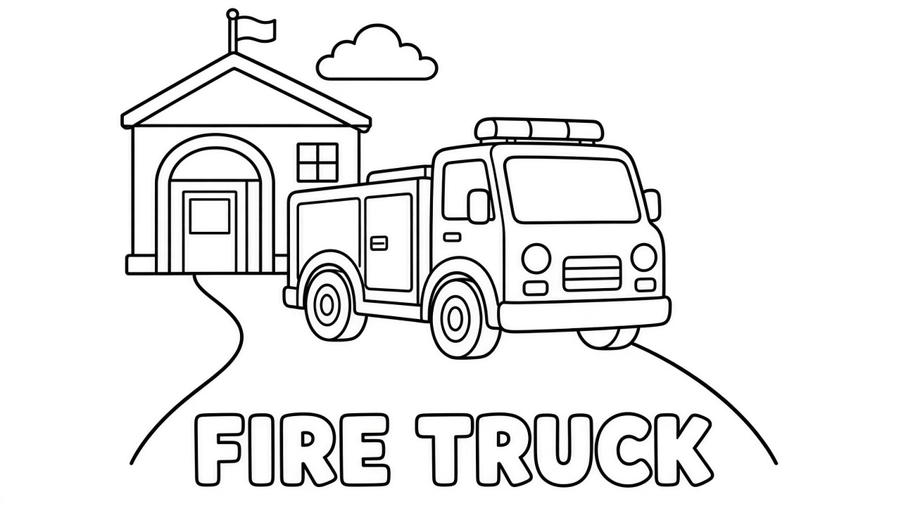

# KDP public review

Remote human-review copies only. **Not** KDP publish approval. Capital: $0.

## book_003 — REVIEW THIS NOW (v3)

Working title: **Little One's: Little Driver Vehicle Coloring Book**

Owner feedback applied:
- Simple **background setting** on each page
- **Bubble-letter** vehicle name at bottom (colorable)
- Series title prefix **Little One's:**

### Samples
Folder: [book_003_style_v3_bg_labels](book_003_style_v3_bg_labels/)

| Page | Preview |
|------|---------|
| Title page |  |
| TRUCK |  |
| TRACTOR |  |
| FIRE TRUCK |  |
| BUS |  |

**Reply in chat:** approve v3 for full 36-page rebuild / tweak title / change label style (e.g. "This is a truck" instead of bubble word) / other notes.

## Older drafts (superseded for style decision)
- [v2 thicker/simpler samples](book_003_style_v2_samples/) — no backgrounds/labels
- [Full v1 Cursor PDF](book_003_VALIDATE_vehicles/interior_draft.pdf) — will be rebuilt after v3 approval

## Page count (locked)
- Target **~64 pages** (POS / shelf appeal — not the earlier 36-page draft count)
- Content/coloring through ~page 59
- Pages **60–63 blank**; page **64 printing info**
