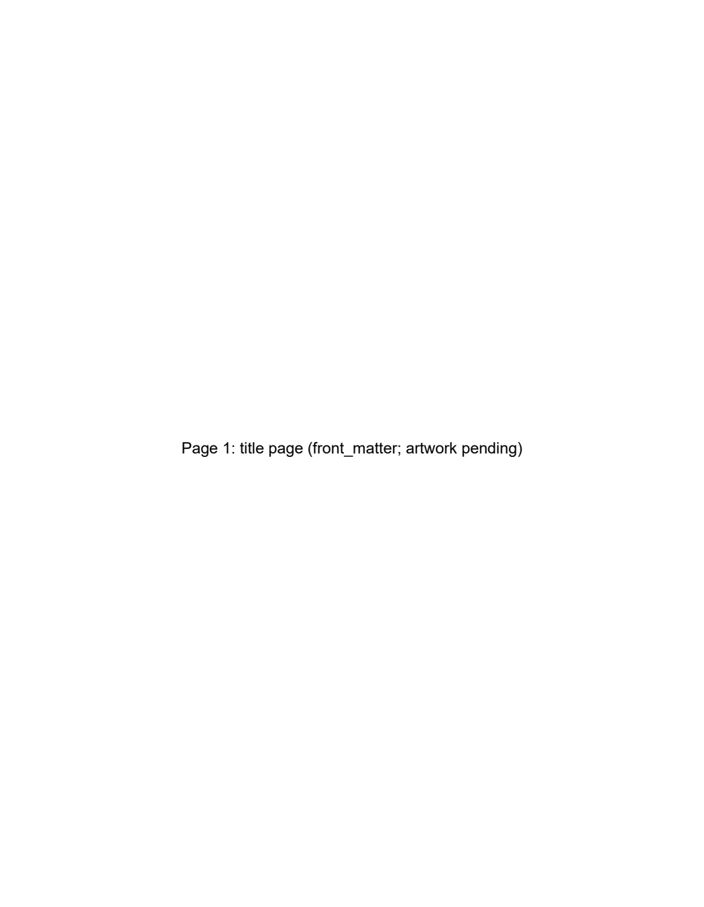
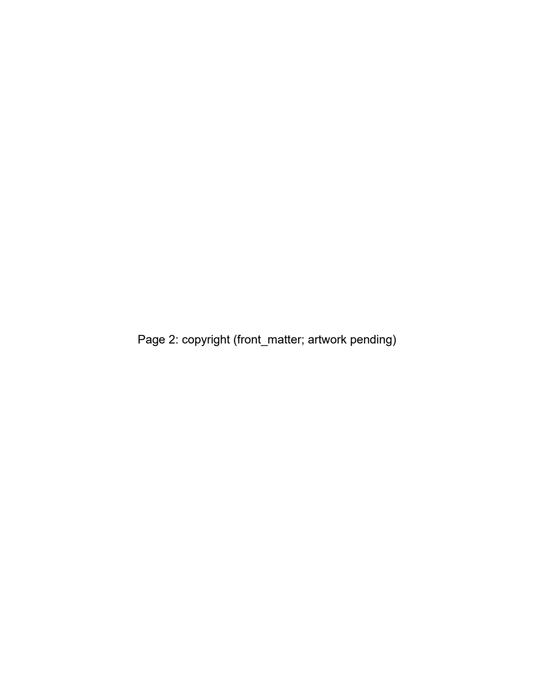
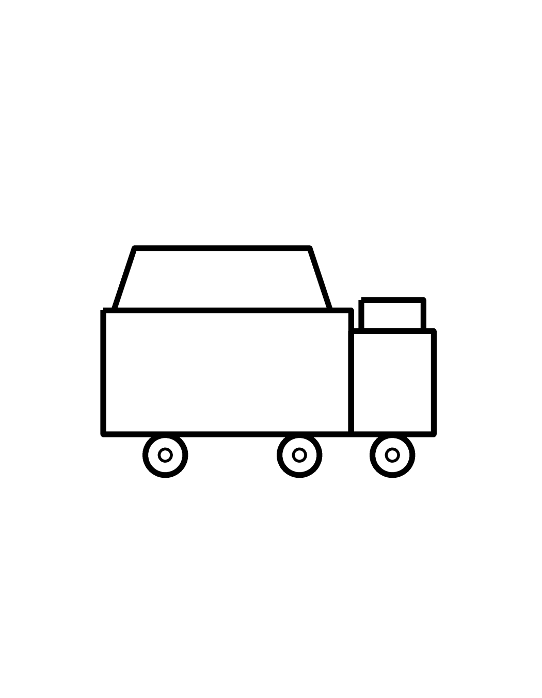
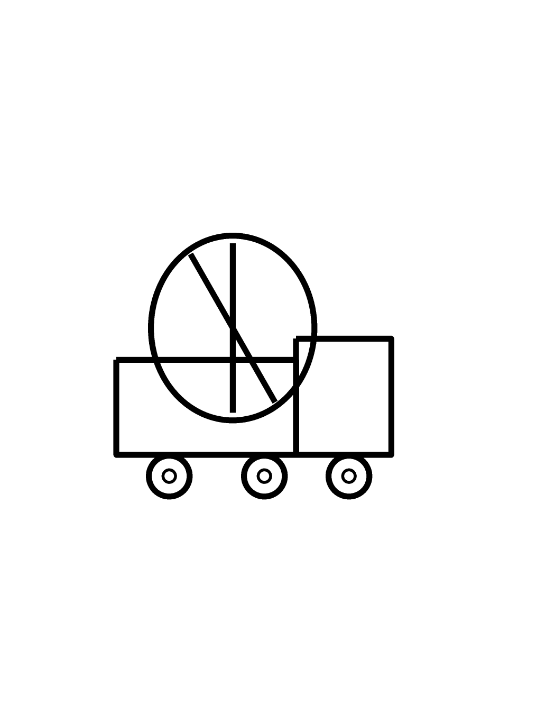
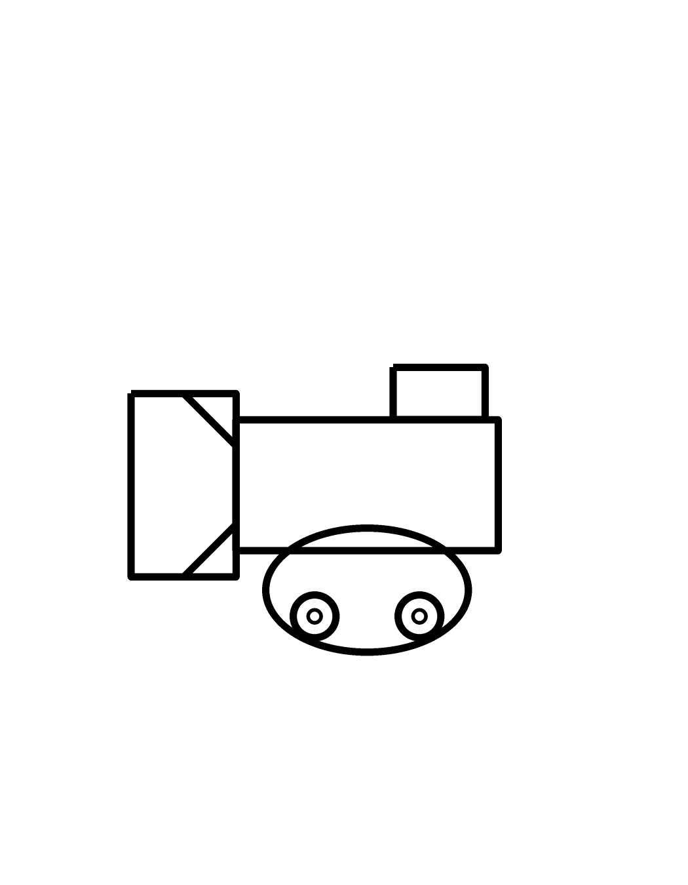
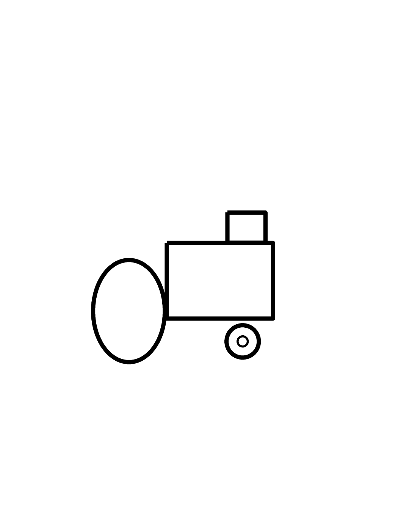
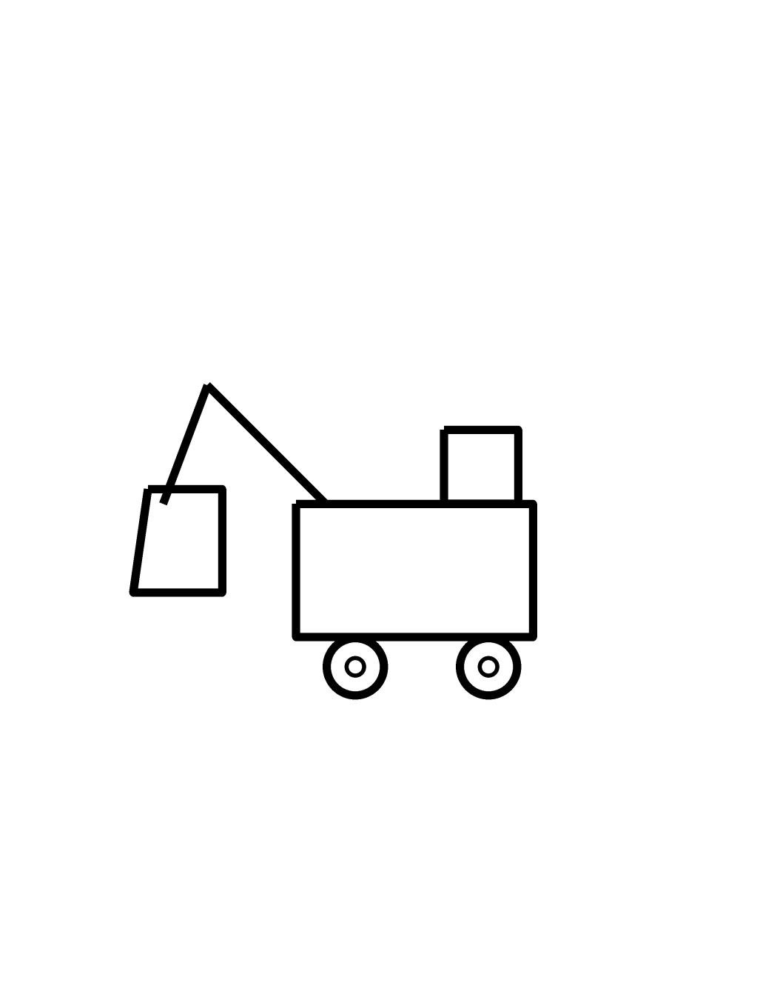

# KDP public review artifacts

Temporary **public** holding area for human visual review.
Not a KDP publish authorization. Capital spent: $0.

## book_003 — VALIDATE trucks draft (superseding concept)

GitHub does not reliably preview PDFs inline. Use the PNG previews below, or download the PDF.

### Preview pages

### PDF
[Download interior_draft.pdf](book_003_VALIDATE_trucks_draft/interior_draft.pdf)

### Status
Owner is pivoting primary VALIDATE concept to **common animals + babies** (adult page with word, then baby page with baby word). Truck draft kept here only for craft reference.
