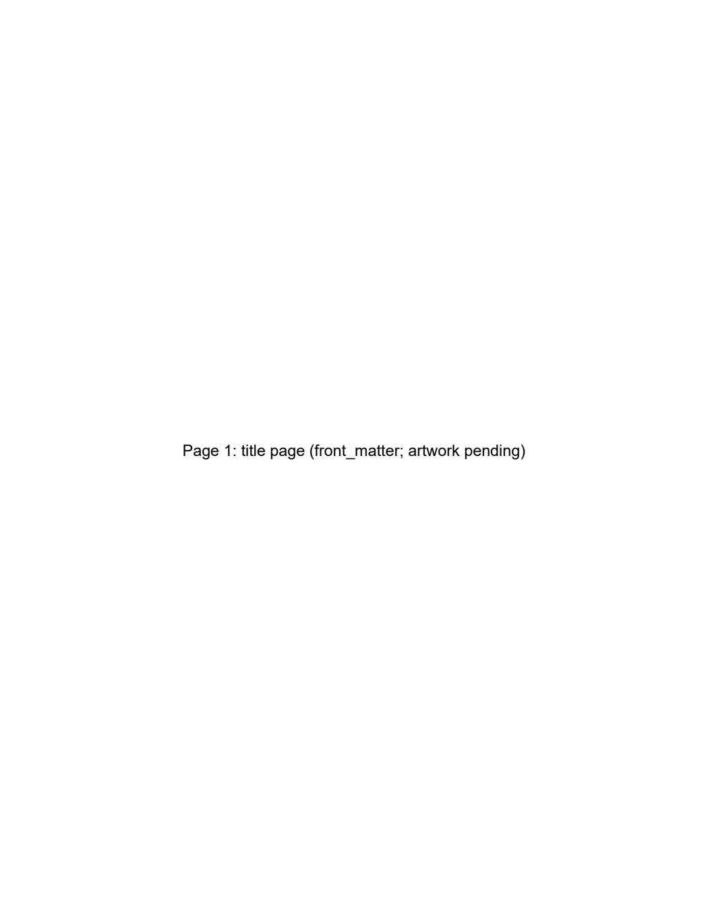
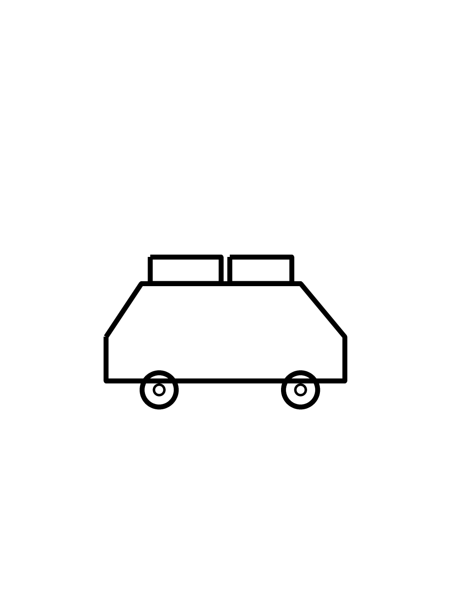
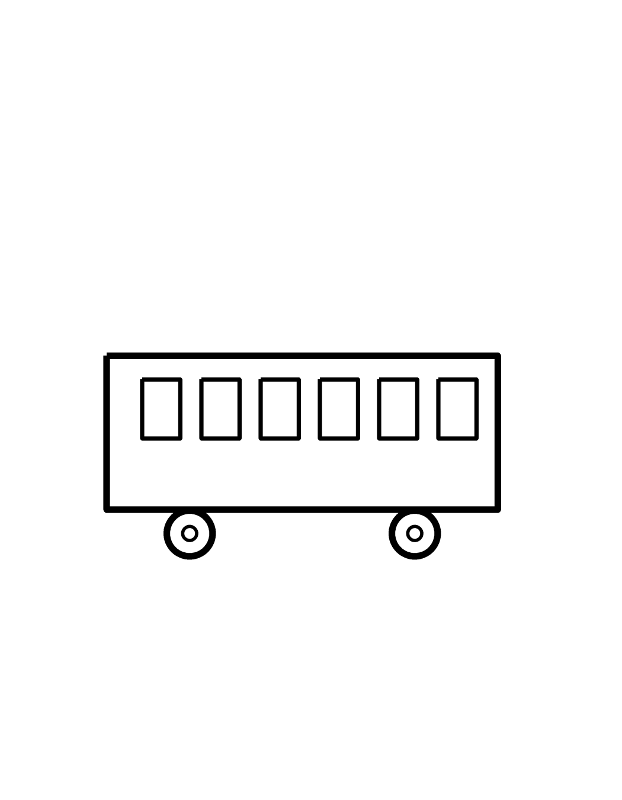
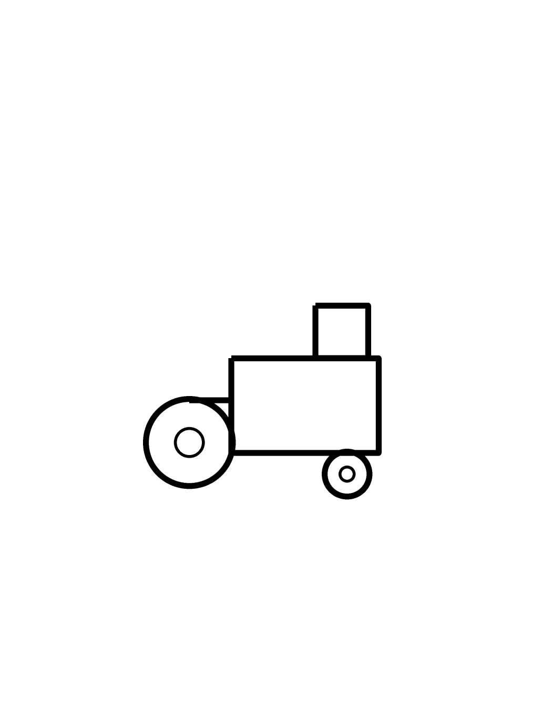
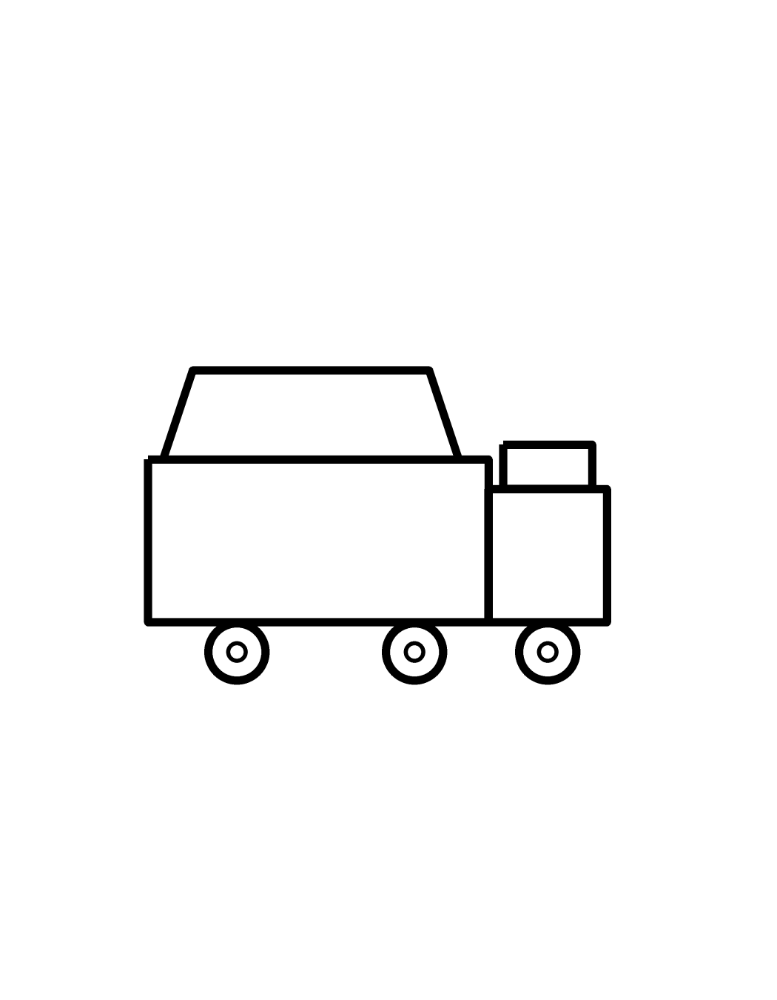
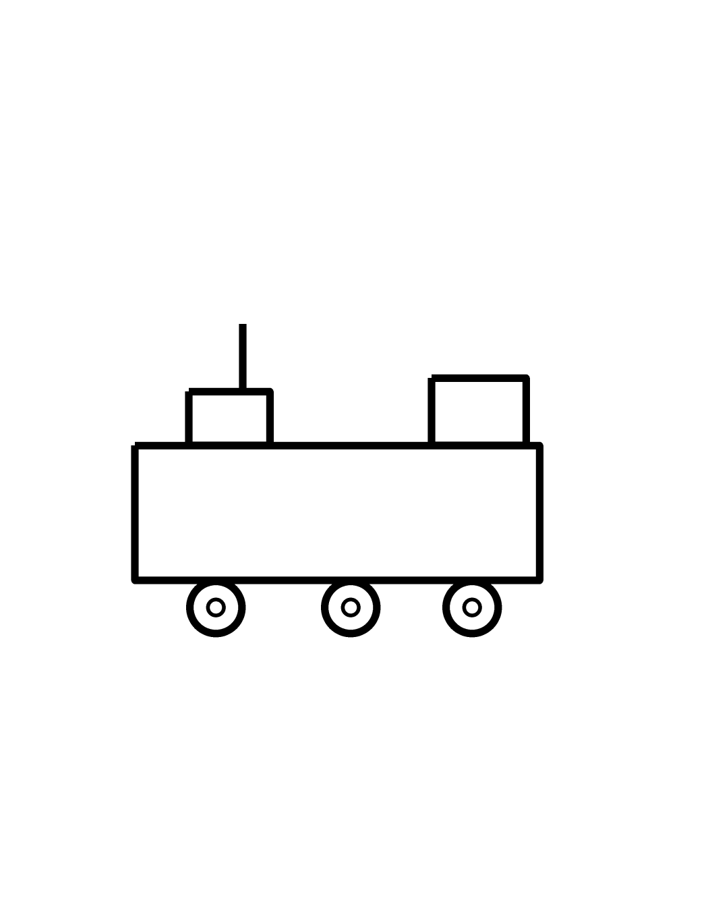
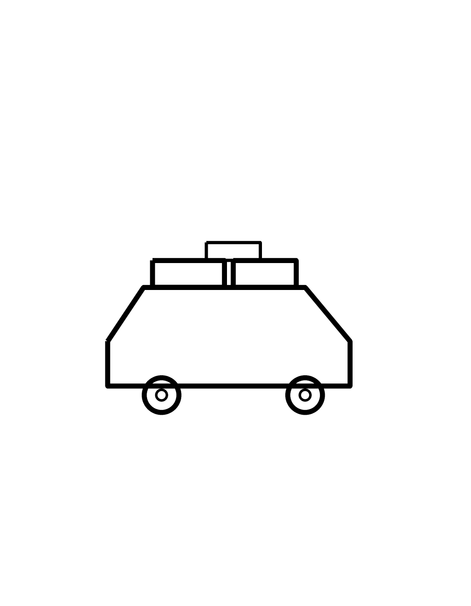
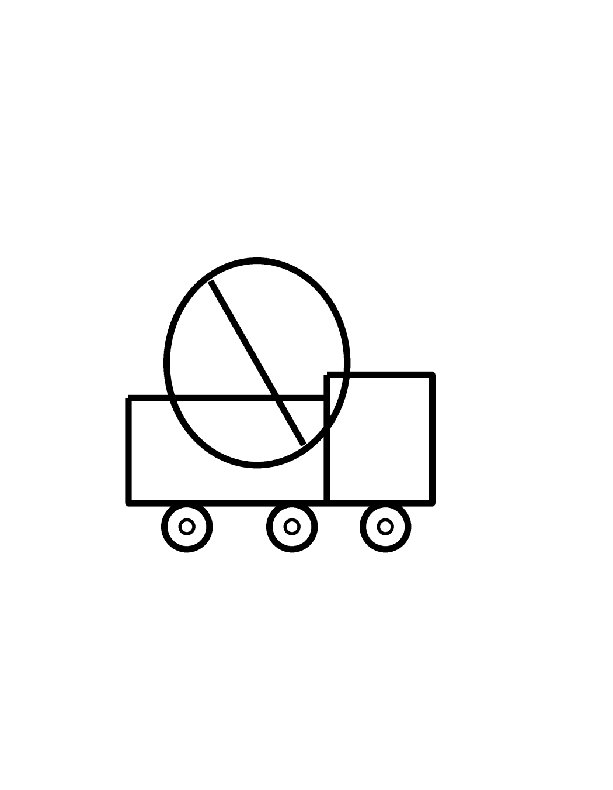
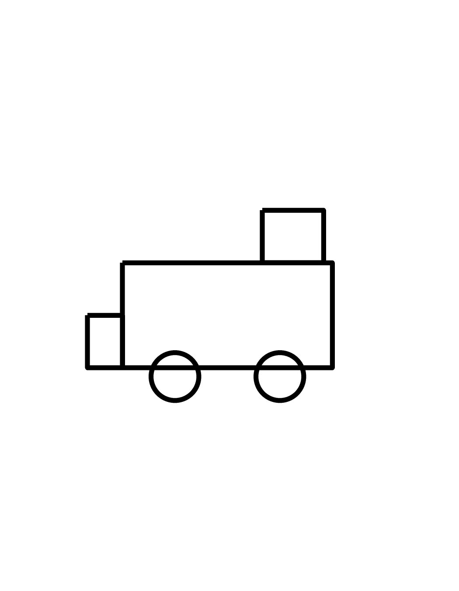

# KDP public review artifacts

Public human-review copies only. **Not** KDP publish authorization. Capital: $0.

## book_003 — Toddler vehicles VALIDATE (current)

**Concept:** cars, trucks, tractors, buses, and other common vehicles for ages 2–4. Thick outlines, one subject per page, no logos/brands.

### Preview pages (GitHub shows these inline)

### PDF download
[interior_draft.pdf](book_003_VALIDATE_vehicles/interior_draft.pdf)

### Notes
- Draft programmatic line art for VALIDATE speed — not final illustration quality
- Cover not built yet
- Adult/baby animals concept parked for a later title
